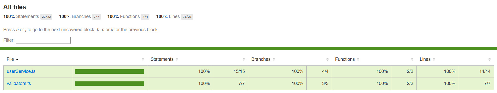

# Sistema de Validação de Cadastro de Usuário

Projeto desenvolvido para a disciplina de QA com foco em testes unitários automatizados.

## Tecnologias utilizadas
- TypeScript
- Jest
- ts-jest

## Funcionalidades
A aplicação realiza o cadastro de usuários com validação das informações fornecidas.

## Regras de Negócio Testadas
- Nome não pode ser vazio
- Email deve conter "@"
- Senha deve ter no mínimo 8 caracteres
- Senha deve conter pelo menos 1 número
- Senha deve conter pelo menos 1 letra maiúscula
- Não permitir email duplicado

## Como executar o projeto

Instalar dependências:

```bash
npm install
```

Executar testes:

```bash
npm test
```

Executar cobertura:

```bash
npm run coverage
```

## Estrutura do projeto

```text
src/
 ├── userService.ts
 └── validators.ts

tests/
 └── userService.test.ts
```

## Relatório de Cobertura

Abaixo está o print do relatório de cobertura gerado pelo Jest:

